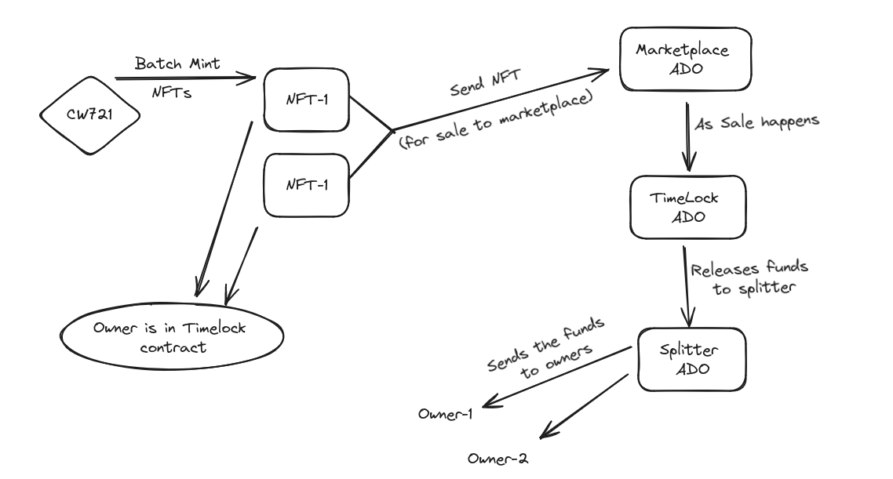

<p>&nbsp;</p>
<p align="center">

</p>

# DEAUTH Platform

## Project Description

The DEAUTH platform addresses the struggles faced by new aspiring illustrators by providing a solution that enables them to showcase their art, monetize their creations, and offer unique value-based NFTs. The platform compensates artists for sales of their diverse design products and allows for shared ownership of design NFTs. Artists can create NFTs of their art and utilize them to produce a variety of products such as shirts, hoodies, and mugs. Additionally, they can monetize their designs further by dividing the ownership of NFTs between multiple owners, with sales benefits distributed according to the proportion of ownership.

## Table of Contents

- [Getting Started](#getting-started)
- [How to Use the Project](#how-to-use-the-project)
- [Credits](#credits)
- [License](#license)
- [How to Contribute to the Project](#how-to-contribute-to-the-project)

## Getting Started

To get started with the development server, follow these steps:

1. **Install dependencies:**
    ```bash
    npm i
    ```

2. **Run the development server:**
    ```bash
    npm run dev
    ```
   or
    ```bash
    yarn dev
    ```

3. **Open http://localhost:3000 with your browser** to see the result.

## Project Idea
<p>&nbsp;</p>
<p align="center">

</p>


## How to Use the Project

1. **Submitting Designs:**
   - Artists can submit their designs to the platform by navigating to the submission section in the user dashboard.
   - They will need to provide necessary details such as title, description, and upload the design file.

2. **Creating NFTs:**
   - Once a design is submitted, the platform automatically creates an NFT associated with the design.
   - The NFT represents ownership and authenticity of the artwork.

3. **Product Creation:**
   - The platform uses the submitted designs to create a range of products such as hoodies, shirts, mugs, etc.
   - Users can browse through the product catalog and select items they wish to purchase.

4. **Purchasing NFT Shares:**
   - Users interested in supporting artists can purchase shares in the NFT associated with a specific design.
   - This gives them ownership rights to a portion of the NFT and a stake in the future sales of products featuring the associated design.

5. **Sales and Revenue Distribution:**
   - As products featuring the design are sold, revenue is generated.
   - Revenue from product sales is distributed proportionally among the shareholders of the NFT associated with the design.
   - Artists receive compensation for sales of their designs, while NFT shareholders earn a return on their investment based on product sales.

6. **Monetization through Shared Ownership:**
   - Artists have the option to further monetize their designs by dividing the ownership of NFTs between multiple owners.
   - Sales benefits are then distributed among the NFT owners according to the proportion of their ownership.

7. **Track Performance:**
   - Artists and NFT shareholders can track the performance of their designs and NFTs through the platform's analytics dashboard.
   - This provides insights into sales trends, revenue generated, and the overall popularity of designs.

By following these steps, artists can showcase their art, users can support their favorite creators, and the platform facilitates a thriving ecosystem where creativity is rewarded.

## Credits

This project utilizes the following libraries and protocols:
- Timelock
- Splitter
- CW721
- Marketplace


## How to Contribute to the Project

### Clone the repository
    ```bash
    git clone https://github.com/deauthe/deauth_andromeda
    ```

### Navigate to the project directory
    ```bash
    cd deauth_andromeda
    ```

### Install dependencies
    ```bash
    npm i
    ```

### Create a new branch for your feature or fix
    ```bash
    git checkout -b feature/new-feature
    ```

### Make your changes to the code

### Add your changes to the staging area
    ```bash
    git add .
    ```

### Commit your changes
    ```bash
    git commit -m "Add new feature or fix"

    ```

### Push your changes to your fork
    ```bash
    git push origin feature/new-feature
    ```

### Create a pull request on the GitHub repository
